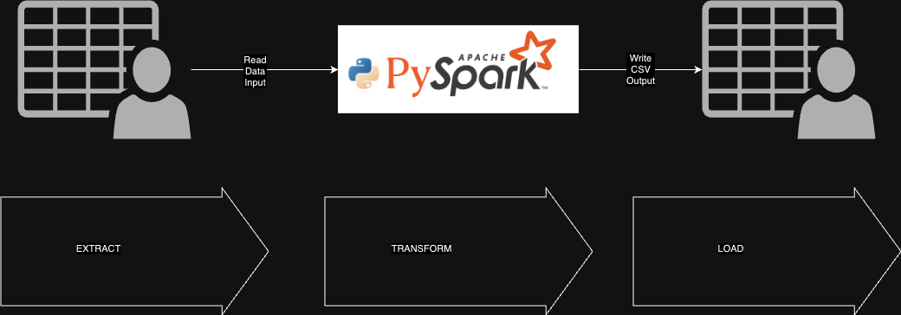

# segwise-assignment
Round 1 assignment for segwise

## Data engineer assignment

Consider you are working as a data engineer in leading data analytics company. 
Given the data of some of the android apps from playstore, your job is to write a pyspark job to generate insights from it. 
Please provide count of apps based on various combination of fields provided to you. Be as comprehensive as you can. 

Some examples questions we might want to answer could be:

How many apps which are free and for a certain genre and launched in a particular year etc? 
How many apps between certain price range, released in certain year, is adSupported and has a certain ratings and of a certain price
etc? 

Date file: google-play-dataset-by-tapivedotcom.csv

## Requirements:
1. You should bucket the numerical fields in reasonable number of bins. 
For example - you can create bins of 5 year ranges and present data as [2000-2005] etc. 
Similar bucketing can be done for price, ratings etc. Atleast 20 unique values should be present for a numerical field to be considered for binning. 
2. Counts should be as comprehensive as possible for different combinations of properties. You can filter out combinations which are smaller than 2% of total volume. 
3. PySpark is the framework to be used. 
4. Output should be in the form of a csv file with column names and corresponding values in a name=value combination separated by semicolon and counts in another column. 
Sample output:
Price=[4-5]; genre=Art & Design; Installs=[10000-100000], 100
This means that there are a 100 apps with a combination of price between 4-5, belonging to genre “Art & Design”, installs between 10k and 100k. 
Year=[2005-2010], 1000 
This means there are a 1000 apps released between years 2005-2010. 

## Assumptions:
1. You can make reasonable assumption on which of the 36 columns are important and provide better insights. 
2. Atleast 12 columns should be chosen and you need to consider all combinations of those 12 columns. 
3. All possible subsets of a set of 12 properties will be of the order of 2^12 ~ 4096. This number will go up when you consider different values for each of the columns. 

## High Level Design:
[High Level Design](HighLevelDesign.drawio) 

## Installation:
1. Install docker
2. Build docker image: `docker build . -t segwise:latest`
3. Run docker process: `docker run -it -d --name segwise segwise:latest`
